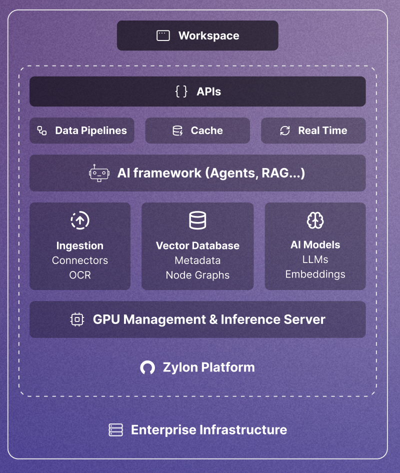

When deployed in your on-premise infrastructure, Zylon Platform unlocks comprehensive AI capabilities through its ready-to-use building blocks and integrated tech stack:

The platform provides both low-level (ZylonGPT) and high-level (Workspace) APIs that run entirely within your secured company infrastructure. This ensures complete data privacy, as no information leaves your premises, enabling you to implement mission-critical workflows with confidence.

A key advantage of Zylon Platform is its unlimited usage model. Unlike cloud-based AI services, there are no restrictions on tokens or inference executions. This allows you to integrate unlimited internal systems and scale your Private AI platform usage without incurring additional costs.
