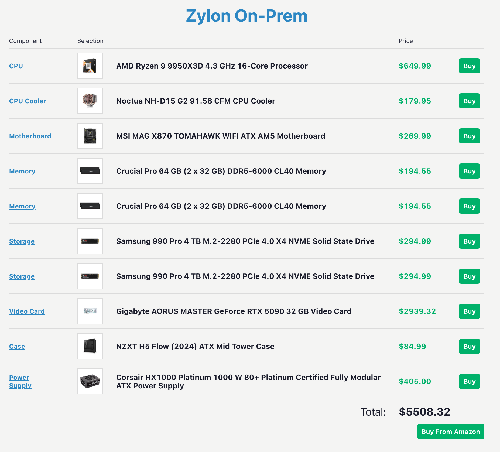

Zylon only has one strict requirement regarding hardware: **it must have access to a GPU with NVIDIA CUDA capabilities**. Depending on the hardware, some AI models might be restricted, so to ensure compatibility aim for newest compatible CUDA versions (12.6+).

Our recommended specifications for the best experience are:

- Operative System: Ubuntu Server 22.04 LTS or 24.04 LTS, clean installation, without additional drivers or software installed.
- CPU: Minimum of 12 core CPU amd64 architecture (x86_64), but 16 cores are recommended
- RAM: Minimum of 64GB, but 128GB are recommended
- Storage: Unbounded, minimum of 4TB of fast storage, but 8TB are recommended
- GPU:
    - Bare metal
        - Server Hardware (external cooling required ⚠️)
            - NVIDIA L40/L40s (48 GB)
            - NVIDIA H100 (80 / 96 GB)
            - NVIDIA A100 (40 / 80 GB)
            - NVIDIA H200 (141 GB)
        - Desktop Hardware (embedded cooling system)
            - NVIDIA GeForce RTX 5090 (32 GB)
    - AWS
        - g6e.xlarge https://instances.vantage.sh/aws/ec2/g6e.xlarge
    - Azure Cloud
        - Standard_NV36ads_A10_v5 (recommended) https://learn.microsoft.com/es-es/azure/virtual-machines/sizes/gpu-accelerated/nvadsa10v5-series?tabs=sizebasic
        - NVv3 (Requires quantized models) https://learn.microsoft.com/en-us/azure/virtual-machines/sizes/gpu-accelerated/nvv3-series?tabs=sizebasic

## What GPU should I buy?

Finding the right GPU for your system can be a tricky process. For example, two GPUs with the same vRAM might not perform the same:

- L4 (server) averages: minimum of 15 tk/s, peak at 89 tk/s
- RTX 4090 (desktop) averages: minimum 6.9 tk/s, peak 45tk/s

On the other hand, depending on the GPU you chose, other features that might impact AI quality will be enabled, if any of them is relevant for your uses cases factor that in for your decision:

|  | Nvidia L40s | Azure A10 | RTX 5090 | A100 / H100 |
| --- | --- | --- | --- | --- |
| Requires Workstation | ✅ | ❌ | ❌ | ✅ |
| LLM | ✅ | ✅ | ✅ | ✅ |
| Reranker* | ✅ | ❌ | ✅ | ✅ |
| Multi-model (images)* | ✅ | ❌ | ✅ | ✅ |

*Currently in development/under testing — subject to change in the future.

For **on-premise bare metal environments** (the usual scenario for Zylon clients), an important factor would be your ability to properly cool the GPU installed in your machine. If you don’t want to take care of it or lack the experience, go for a desktop hardware option. But keep in mind that in case you want to run bigger models or provide service to several hundreds of users, you might need to install a rack with a couple in parallel or be forced to move to server hardware models.

Another important factor would be the investment, specially regarding the GPU. The price ranges May 5, 2025 for the aforementioned models are:

| **GPU Model** | **vRAM (GB)** | **Price Price (USD)** |
| --- | --- | --- |
| NVIDIA L40 48GB/L40s | 48 | $7,900 – $9000 |
| NVIDIA H100 (PCIe) | 80 | $25,000 – $30,000 |
| NVIDIA H100 (SXM) | 80 | $35,000 – $40,000 |
| NVIDIA H100 (NVL) | 96 | $40,000 - $45,000 |
| NVIDIA A100 (PCIe) | 40 | $8,000 - $10,000 |
| NVIDIA A100 (PCIe) | 80 | $18,000 - $20,000 |
| NVIDIA A100 (SXM) | 40 | $10,000 - $12,000 |
| NVIDIA A100 (SXM) | 80 | $20,000 - $25,000 |
| NVIDIA H200 | 141 | $30,000 - $32,000 |
| NVIDIA GeForce RTX 5090 | 32 | $3,000 - $3,500 |

In any case, as a direct answer to the question of which GPU should you buy, keep in mind that as of today we have several clients running Zylon on RTX 5090s supporting 200+ users in their organizations with great performance.

## Reference hardware for mid-size organization

If you need to acquired your AI-capable equipment from scratch, as of July 29, 2025 please consider the following [hardware recommendation](https://pcpartpicker.com/user/pablo.zylon/saved/#view=csWVD3):

This configuration includes an RTX GeForce NVIDIA 5090 (32 GB), a powerful GPU (16 cores), 128 GB of RAM and enough storage capacity to operate Zylon with margin to grow. It also provides a robust cooling solution to ensure optimal performance under heavy workloads, as well as a big motherboard to fit two GPUs at some point if needed in the future.

Keep in mind that this is just a recommendation, so feel free to adapt it to your preferences while keeping similar capabilities for ideal performance. We have used Amazon as a provider considering that you can assemble all the parts together by yourself, but any provider that you usually work with should be able to get a similar hardware and assemble it for you.

## Reference hardware for big-size organization

In these scenarios, we don’t provide a reference hardware configuration until we understand the requirements not only regarding number of users, but also what kind of internal operations will be run in parallel by leveraging the platform API.

In you are in this situation, we are likely already discussing about this.
